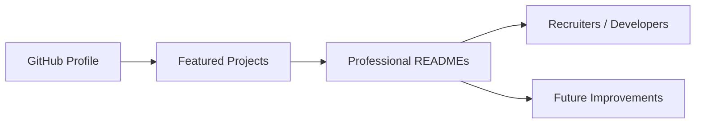

<!-- REPO_HEALTH_BADGE_START -->

<!-- REPO_HEALTH_BADGE_END -->

  

  
  
  
  

  

---

## Recruiter Snapshot

<table>
  <tr>
    <td width="28%"><strong>Role Target</strong></td>
    <td>Full-stack developer, Flutter developer, junior software engineer, product-focused engineering intern</td>
  </tr>
  <tr>
    <td><strong>Strengths</strong></td>
    <td>Workflow-heavy web apps, polished mobile utilities, automation tools, clean README/documentation, product thinking</td>
  </tr>
  <tr>
    <td><strong>Main Stack</strong></td>
    <td>React, TypeScript, JavaScript, Node.js, Express, FastAPI, Python, Flutter, Dart, PostgreSQL, MySQL, Prisma, Firebase</td>
  </tr>
  <tr>
    <td><strong>Location</strong></td>
    <td>Rajkot, Gujarat, India</td>
  </tr>
  <tr>
    <td><strong>Status</strong></td>
    <td>Open to internships, collaboration, freelance-style product work, and serious learning opportunities</td>
  </tr>
</table>

## What I Build

I build practical software around real workflows — not just demo screens. My focus is on products that are useful, presentable, and easy for another developer or recruiter to understand quickly.

- **Full-stack workflow platforms** with dashboards, authentication, admin flows, APIs, and structured data
- **Flutter mobile apps** with clean UI, local storage, offline-first thinking, and productivity-focused experiences
- **Automation and developer tools** that reduce repetitive work, generate assets, or improve project presentation
- **Portfolio-grade repositories** with setup steps, architecture notes, roadmap, quality checks, and review-friendly documentation

## Featured Work

  
  

  
  

| Project | Product Signal | Engineering Signal |
| --- | --- | --- |
| **[ExporTrack AI](https://github.com/bhedanikhilkumar-code/ExporTrack-AI)** | Export logistics workflow platform for shipment visibility, document verification, and operational dashboards | React, TypeScript, Node.js, Express, MySQL, dashboard UX, workflow modeling |
| **[Planora](https://github.com/bhedanikhilkumar-code/Planora)** | Calendar and admin platform with recurrence, ICS import/export, authentication, and event workflows | React, TypeScript, Node.js, Prisma, PostgreSQL, scheduling logic, API design |
| **[Site Surveyor Compass](https://github.com/bhedanikhilkumar-code/site-surveyor-compass)** | Field utility app for GPS workflows, measurement tools, waypoint management, and site reporting | Flutter, Dart, Provider, Hive, Firebase, mobile UX, offline-oriented flows |
| **[AutoPortfolio Builder](https://github.com/bhedanikhilkumar-code/AutoPortfolio-Builder)** | Portfolio generator that turns GitHub/LinkedIn input into portfolio-ready content and exports | FastAPI, Python, JavaScript, authentication, admin tools, content automation |

## Engineering Style

<table>
  <tr>
    <td width="50%" valign="top">
      <strong>Product-first</strong> 
      I start from the workflow: who uses it, what they need to finish, and what friction can be removed.
        
      <strong>Readable architecture</strong> 
      I prefer clear modules, practical naming, setup docs, and repository structure that another developer can follow.
    </td>
    <td width="50%" valign="top">
      <strong>UI polish</strong> 
      I care about spacing, hierarchy, dark professional aesthetics, and screens that feel intentional.
        
      <strong>Automation mindset</strong> 
      If a task is repetitive, I look for a tool, script, template, or workflow improvement to make it faster.
    </td>
  </tr>
</table>

## Toolbox

  

  
  
  
  

## Project Index

- **[Developer Avatar Generator](https://github.com/bhedanikhilkumar-code/Developer-Avatar-Generator)** — deterministic developer avatars as SVG through API, CLI, and web UI
- **[Money King](https://github.com/bhedanikhilkumar-code/money-king)** — Flutter expense tracker with budgets, cloud sync, passcode, and biometric unlock
- **[Smart Study Planner](https://github.com/bhedanikhilkumar-code/Smart-Study-Planner)** — study planning system with scheduling, backlog tracking, analytics, and revision recommendations
- **[DevBadge Generator](https://github.com/bhedanikhilkumar-code/devbadge-generator)** — animated badges, stack previews, presets, Markdown copy, and export flows
- **[Sanskriti Panchang](https://github.com/bhedanikhilkumar-code/SanskritiPanchang)** — Hindu calendar app built with Flutter and Dart

## GitHub Activity

  
  

  

  

  

## Education & Direction

- **Computer Engineering** — Atmiya Institute of Technology & Science
- **English:** EF SET B2 Upper Intermediate
- **Learning direction:** stronger backend architecture, cleaner Flutter state management, testing habits, deployment workflows, and AI-assisted productivity

## Connect

  
  
  
  

<!-- PORTFOLIO_DOC_STANDARD_START -->

## Portfolio Documentation Standard

This profile follows a documentation-first portfolio style: highlighted projects should clearly explain their product goal, tech stack, architecture, setup process, roadmap, and review notes.

**Repository polish checklist used across the portfolio:**

- Clear one-line value proposition
- Professional badges and stack indicators
- Architecture or workflow diagram
- Feature/capability table
- Local setup commands
- Quality checks and roadmap
- Contribution and license notes

<!-- PORTFOLIO_DOC_STANDARD_END -->

<!-- PROJECT_DOCS_HUB_START -->

## Documentation Hub

| Document | Purpose |
| --- | --- |
| [Architecture](docs/ARCHITECTURE.md) | System layers, workflow, data/state model, and extension points. |
| [Case Study](docs/CASE_STUDY.md) | Product framing, decisions, tradeoffs, and portfolio story. |
| [Roadmap](docs/ROADMAP.md) | Practical next steps for turning the project into a stronger portfolio asset. |
| [Quality Standard](docs/QUALITY.md) | Repository health checks, review standards, and quality gates. |
| [Review Checklist](docs/REVIEW_CHECKLIST.md) | Final share/recruiter review checklist for a stronger GitHub impression. |
| [Contributing](CONTRIBUTING.md) | Branching, commit, review, and quality guidelines. |
| [Security](SECURITY.md) | Responsible disclosure and safe configuration notes. |
| [Support](SUPPORT.md) | How to ask for help or report issues clearly. |
| [Code of Conduct](CODE_OF_CONDUCT.md) | Collaboration expectations for respectful project activity. |

<!-- PROJECT_DOCS_HUB_END -->
