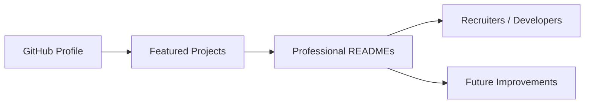

<!-- REPO_HEALTH_BADGE_START -->

<!-- REPO_HEALTH_BADGE_END -->

  

  <strong>Full-stack developer • Flutter builder • automation-minded engineer</strong> 
  I build workflow-first apps with clean UX, maintainable architecture, and review-friendly documentation.

  <a href="https://github.com/bhedanikhilkumar-code">GitHub</a> •
  <a href="https://www.linkedin.com/in/bheda-nikhilkumar-6858322ab/">LinkedIn</a> •
  <a href="mailto:bhedanikhilkumar@gmail.com">Email</a> •
  <a href="https://bhedanikhilkumar-code.github.io/Bheda-Nikhilkumar-portfolio/">Portfolio</a>

---

## Professional Snapshot

I am **Nikhil Bheda**, a Computer Engineering student and product-minded developer from Rajkot, Gujarat. I build full-stack dashboards, Flutter utilities, automation tools, and portfolio-grade repositories that are easy for recruiters, mentors, and developers to evaluate.

| Signal | Details |
| --- | --- |
| **Role direction** | Full-stack developer, Flutter developer, junior software engineer, product-focused engineering intern |
| **Strongest evidence** | Workflow apps with auth/admin flows, dashboards, API design, mobile UX, and documentation-first repositories |
| **Core stack** | React, TypeScript, JavaScript, Node.js, Express, FastAPI, Python, Flutter, Dart, PostgreSQL, MySQL, Prisma, Firebase |
| **Current focus** | Backend architecture, Flutter state management, testing habits, deployment workflows, and AI-assisted productivity |
| **Location** | Rajkot, Gujarat, India |
| **Availability** | Internships, collaborations, freelance-style product work, and serious learning opportunities |

### 30-Second Profile Scan

- **Best first impression:** Product-focused full-stack and Flutter work with polished documentation
- **Most reviewable projects:** ExporTrack AI, Planora, Site Surveyor Compass, and AutoPortfolio Builder
- **What I optimize for:** Clear workflows, clean UI hierarchy, practical architecture, and README-first presentation
- **Collaboration fit:** Internships, product prototypes, dashboard apps, Flutter utilities, and automation-heavy tools

## What I Build

I like building software that has a clear purpose beyond the demo screen: dashboards that support decisions, mobile apps that help users finish tasks, and automation tools that reduce repetitive work. My goal is to make each project understandable, runnable, and useful enough for a real review conversation.

- **Full-stack workflow platforms** with authentication, admin flows, dashboards, REST APIs, structured data, and review-friendly documentation
- **Flutter mobile apps** with clean UI, local storage, offline-first thinking, and productivity-oriented experiences
- **Automation and developer tools** that generate assets, improve project presentation, or make repetitive tasks faster
- **Applied AI/data projects** that turn domain problems into measurable predictions, dashboards, and decision-support flows
- **Portfolio-grade repositories** with setup instructions, architecture notes, roadmaps, quality checks, and clear product positioning

  

## Portfolio Proof Points

| Review angle | Evidence in this profile |
| --- | --- |
| **Product thinking** | Projects are framed around workflows, users, dashboards, and task completion rather than only tech demos |
| **Engineering maturity** | Featured repos show API design, authentication, scheduling logic, local setup docs, and quality checklists |
| **Mobile capability** | Flutter projects focus on usable interfaces, local storage, state management, and offline-oriented experiences |
| **Communication** | Documentation hub, case studies, review guides, roadmaps, and project summaries make the work easier to evaluate |

## Featured Portfolio Work

> Stable review links for the projects that best show product thinking, implementation depth, and portfolio readiness.

| Project | Best review angle | Engineering signal |
| --- | --- | --- |
| **[ExporTrack AI](https://github.com/bhedanikhilkumar-code/ExporTrack-AI)** | Export logistics workflows, shipment visibility, document verification, and operations dashboards | React, TypeScript, Node.js, Express, MySQL, workflow modeling, dashboard UX, role-based flows |
| **[Planora](https://github.com/bhedanikhilkumar-code/Planora)** | Calendar/admin workflows with recurrence, ICS import/export, authentication, and event management | React, TypeScript, Node.js, Prisma, PostgreSQL, scheduling logic, API design, data modeling |
| **[Site Surveyor Compass](https://github.com/bhedanikhilkumar-code/site-surveyor-compass)** | Field utility UX for GPS workflows, measurements, waypoint management, and site reporting | Flutter, Dart, Provider, Hive, Firebase, mobile UX, offline-oriented flows, field-first design |
| **[AutoPortfolio Builder](https://github.com/bhedanikhilkumar-code/AutoPortfolio-Builder)** | Portfolio automation that turns GitHub/LinkedIn inputs into review-ready content and exports | FastAPI, Python, JavaScript, auth/admin tooling, content automation, recruiter-facing output |

## Best Review Path

If you are reviewing my work quickly, this path gives the clearest signal:

1. **Product + dashboard thinking:** [ExporTrack AI](https://github.com/bhedanikhilkumar-code/ExporTrack-AI)
2. **Scheduling/data modeling:** [Planora](https://github.com/bhedanikhilkumar-code/Planora)
3. **Flutter/mobile utility UX:** [Site Surveyor Compass](https://github.com/bhedanikhilkumar-code/site-surveyor-compass)
4. **Automation + backend tooling:** [AutoPortfolio Builder](https://github.com/bhedanikhilkumar-code/AutoPortfolio-Builder)
5. **Portfolio index:** [Project Showcase Catalog](docs/PROJECT_SHOWCASE.md)
6. **Structured evaluation:** [Portfolio Review Guide](docs/PORTFOLIO_REVIEW_GUIDE.md)

## Engineering Style

| Principle | How I apply it |
| --- | --- |
| **Product-first thinking** | I start from the workflow: who uses it, what they need to finish, and where software can remove friction. |
| **Readable architecture** | I prefer practical naming, clear modules, setup docs, and repository structure that another developer can follow. |
| **Polished UI direction** | I care about spacing, hierarchy, dark professional aesthetics, and interfaces that feel intentional. |
| **Automation mindset** | If a task is repetitive, I look for a script, template, workflow, or tool that makes it faster and more reliable. |

## Toolbox

> Stable text-first stack overview, so the section stays readable even when third-party icon services are slow or unavailable.

| Layer | Tools and strengths |
| --- | --- |
| **Frontend** | React, TypeScript, JavaScript, HTML, CSS, responsive UI, dashboard UX |
| **Backend** | Node.js, Express, FastAPI, Python, REST APIs, authentication flows |
| **Mobile** | Flutter, Dart, Provider, Hive, Firebase, offline-first mobile experiences |
| **Database** | PostgreSQL, MySQL, Prisma, structured data modeling |
| **Quality & tooling** | Git, GitHub, Docker, documentation, repository health checks, CI workflows |

## Project Index

### Developer Tools & Automation

- **[Developer Avatar Generator](https://github.com/bhedanikhilkumar-code/Developer-Avatar-Generator)** — deterministic SVG avatars through API, CLI, and web UI
- **[DevBadge Generator](https://github.com/bhedanikhilkumar-code/devbadge-generator)** — animated badges, stack previews, presets, Markdown copy, and exports
- **[GitHub Contribution Poster Maker](https://github.com/bhedanikhilkumar-code/github-contribution-poster-maker)** — contribution-style poster generator with custom patterns and export flows
- **[CommitPilot](https://github.com/bhedanikhilkumar-code/CommitPilot)** — Python CLI for planning goals, tracking progress, and building consistent commit habits

### Flutter / Mobile Apps

- **[Money King](https://github.com/bhedanikhilkumar-code/money-king)** — Flutter expense tracker with budgets, cloud sync, passcode, and biometric unlock
- **[Site Surveyor Compass](https://github.com/bhedanikhilkumar-code/site-surveyor-compass)** — GPS/measurement field utility with offline-oriented mobile workflows
- **[Sanskriti Panchang](https://github.com/bhedanikhilkumar-code/SanskritiPanchang)** — Hindu calendar app with Panchang, festival, Choghadiya, and Hindi-first UX
- **[iOS Emoji Story Maker](https://github.com/bhedanikhilkumar-code/iOS-Emoji-Story-Maker)** — playful Flutter story/emoji creation experience with mobile UI direction

### Full-Stack Productivity Systems

- **[Planora](https://github.com/bhedanikhilkumar-code/Planora)** — scheduling/admin platform with recurrence, ICS flows, auth, APIs, and data modeling
- **[Smart Study Planner](https://github.com/bhedanikhilkumar-code/Smart-Study-Planner)** — study planning system with scheduling, backlog tracking, analytics, and revision recommendations
- **[RepoNova100](https://github.com/bhedanikhilkumar-code/RepoNova100)** — AI-assisted project idea planner with FastAPI backend, tests, and CI

### Applied AI / Data Systems

- **[AI Manufacturing Intelligence](https://github.com/bhedanikhilkumar-code/ai-manufacturing-intelligence)** — batch-level optimization for energy consumption and carbon reduction
- **[Noninvasive Disease Risk Predictor](https://github.com/bhedanikhilkumar-code/noninvasive-disease-risk-predictor)** — final-year health-risk prediction system with risk scores, insights, and analytics dashboard

## Quality Signals

- Repository health workflow validates required profile, documentation, and collaboration files
- Featured repositories are positioned with product purpose, stack, review angle, and engineering signal
- Documentation hub keeps architecture, case study, roadmap, quality standards, and review checklists visible
- Project index groups work by reviewer intent: full-stack, Flutter/mobile, automation, and applied AI/data systems
- Public repository descriptions and topics are aligned for GitHub cards and search
- Profile is structured for both fast recruiter scanning and deeper developer review

## GitHub Activity

> Stable GitHub-native activity links without generated animation dependencies or third-party activity widgets.

| Activity view | Where to review |
| --- | --- |
| **Contribution graph** | [GitHub profile overview](https://github.com/bhedanikhilkumar-code) |
| **Recently updated repositories** | [Repositories sorted by latest activity](https://github.com/bhedanikhilkumar-code?tab=repositories&sort=updated) |
| **Portfolio project catalog** | [Project Showcase Catalog](docs/PROJECT_SHOWCASE.md) |
| **Repository health** | [Repository Health workflow](https://github.com/bhedanikhilkumar-code/bhedanikhilkumar-code/actions/workflows/repository-health.yml) |

## Education & Direction

- **Computer Engineering** — Atmiya Institute of Technology & Science
- **English:** EF SET B2 Upper Intermediate
- **Currently improving:** backend architecture, Flutter state management, testing habits, deployment workflows, and AI-assisted productivity

## Connect

| Channel | Link |
| --- | --- |
| **Email** | [bhedanikhilkumar@gmail.com](mailto:bhedanikhilkumar@gmail.com) |
| **LinkedIn** | [Nikhil Bheda](https://www.linkedin.com/in/bheda-nikhilkumar-6858322ab/) |
| **Portfolio** | [View portfolio website](https://bhedanikhilkumar-code.github.io/Bheda-Nikhilkumar-portfolio/) |
| **Resume** | [Read resume](RESUME.md) |

<!-- PORTFOLIO_DOC_STANDARD_START -->

## Portfolio Documentation Standard

This profile follows a documentation-first portfolio style: highlighted projects should clearly explain their product goal, tech stack, architecture, setup process, roadmap, and review notes.

**Repository polish checklist used across the portfolio:**

- Clear one-line value proposition
- Professional badges and stack indicators
- Architecture or workflow diagram
- Feature/capability table
- Local setup commands
- Quality checks and roadmap
- Contribution and license notes

<!-- PORTFOLIO_DOC_STANDARD_END -->

<!-- PROJECT_DOCS_HUB_START -->

## Documentation Hub

| Document | Purpose |
| --- | --- |
| [Architecture](docs/ARCHITECTURE.md) | System layers, workflow, data/state model, and extension points. |
| [Case Study](docs/CASE_STUDY.md) | Product framing, decisions, tradeoffs, and portfolio story. |
| [Roadmap](docs/ROADMAP.md) | Practical next steps for turning the project into a stronger portfolio asset. |
| [Project Showcase](docs/PROJECT_SHOWCASE.md) | Categorized portfolio catalog across full-stack, Flutter, automation, AI, and applied projects. |
| [Quality Standard](docs/QUALITY.md) | Repository health checks, review standards, and quality gates. |
| [Portfolio Review Guide](docs/PORTFOLIO_REVIEW_GUIDE.md) | Fast review path for recruiters, mentors, collaborators, and developers. |
| [Review Checklist](docs/REVIEW_CHECKLIST.md) | Final share/recruiter review checklist for a stronger GitHub impression. |
| [Contributing](CONTRIBUTING.md) | Branching, commit, review, and quality guidelines. |
| [Security](SECURITY.md) | Responsible disclosure and safe configuration notes. |
| [Support](SUPPORT.md) | How to ask for help or report issues clearly. |
| [Code of Conduct](CODE_OF_CONDUCT.md) | Collaboration expectations for respectful project activity. |

<!-- PROJECT_DOCS_HUB_END -->
