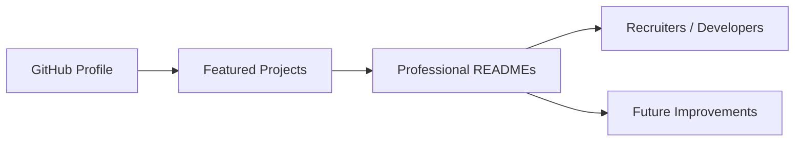

<!-- REPO_HEALTH_BADGE_START -->

<!-- REPO_HEALTH_BADGE_END -->

  

  
  
  
  

  

---

## 👋 About Me

I am a **Computer Engineering student** from Rajkot, Gujarat, focused on building practical software that looks polished, solves clear problems, and is maintainable beyond the demo stage.

My projects mainly sit at the intersection of **full-stack platforms**, **Flutter mobile apps**, **workflow automation**, and **developer productivity tools**.

- 🔭 Currently building production-style portfolio projects with cleaner architecture and documentation
- 🧩 Interested in workflow-heavy products, dashboards, offline-first mobile apps, and automation systems
- 🚀 Open to internships, collaborations, freelance-style product work, and learning-focused opportunities
- 🎯 Goal: ship useful software with strong UX, clear documentation, and reliable engineering foundations

## ⚡ Quick Highlights

<table>
  <tr>
    <td width="50%" valign="top">
      <strong>Product-Focused Engineering</strong> 
      I prefer building apps around real user workflows, not just isolated features.
        
      <strong>Full-Stack Development</strong> 
      React, TypeScript, Node.js, Express, FastAPI, PostgreSQL, MySQL, and Prisma.
    </td>
    <td width="50%" valign="top">
      <strong>Flutter Mobile Apps</strong> 
      Dart and Flutter apps with clean UI, local storage, productivity flows, and practical utilities.
        
      <strong>Automation Mindset</strong> 
      Tools that reduce repetitive work, improve project presentation, and make workflows smoother.
    </td>
  </tr>
</table>

## 🧰 Tech Stack

  

  
  
  
  

## 🚀 Featured Projects

  
  

  
  

| Project | What it does | Stack |
| --- | --- | --- |
| **[ExporTrack AI](https://github.com/bhedanikhilkumar-code/ExporTrack-AI)** | Export logistics workflow platform for shipment tracking, document verification, and operational dashboards. | React, TypeScript, Node.js, Express, MySQL |
| **[Planora](https://github.com/bhedanikhilkumar-code/Planora)** | Calendar/admin platform with recurrence, ICS import/export, authentication, and PostgreSQL-backed workflows. | React, TypeScript, Node.js, Prisma, PostgreSQL |
| **[Site Surveyor Compass](https://github.com/bhedanikhilkumar-code/site-surveyor-compass)** | Flutter field utility app for GPS workflows, measurement tools, waypoints, and on-site reporting. | Flutter, Dart, Provider, Hive, Firebase |
| **[AutoPortfolio Builder](https://github.com/bhedanikhilkumar-code/AutoPortfolio-Builder)** | Portfolio generator using GitHub/LinkedIn inputs, authentication, admin tooling, and export workflows. | FastAPI, Python, JavaScript |

## 📌 More Work

- **[Developer Avatar Generator](https://github.com/bhedanikhilkumar-code/Developer-Avatar-Generator)** — deterministic developer avatars as SVG through API, CLI, and web UI
- **[Money King](https://github.com/bhedanikhilkumar-code/money-king)** — Flutter expense tracker with budgets, sync, passcode, and biometric unlock
- **[Smart Study Planner](https://github.com/bhedanikhilkumar-code/Smart-Study-Planner)** — study planning system with scheduling, backlog tracking, analytics, and revision recommendations
- **[DevBadge Generator](https://github.com/bhedanikhilkumar-code/devbadge-generator)** — animated badges, stack previews, presets, Markdown copy, and export flows

## 📊 GitHub Activity

  
  

  

  

  

## 🎓 Education

- **Computer Engineering** — Atmiya Institute of Technology & Science
- **English:** EF SET B2 Upper Intermediate
- **Strong interests:** product engineering, full-stack systems, mobile UX, automation, and practical AI-assisted workflows

## 🤝 Let's Connect

  
  
  
  

  

<!-- PORTFOLIO_DOC_STANDARD_START -->

## Portfolio Documentation Standard

This profile follows a documentation-first portfolio style: highlighted projects should clearly explain their product goal, tech stack, architecture, setup process, roadmap, and review notes.

**Repository polish checklist used across the portfolio:**

- Clear one-line value proposition
- Professional badges and stack indicators
- Architecture or workflow diagram
- Feature/capability table
- Local setup commands
- Quality checks and roadmap
- Contribution and license notes

<!-- PORTFOLIO_DOC_STANDARD_END -->

<!-- PROJECT_DOCS_HUB_START -->

## Documentation Hub

| Document | Purpose |
| --- | --- |
| [Architecture](docs/ARCHITECTURE.md) | System layers, workflow, data/state model, and extension points. |
| [Case Study](docs/CASE_STUDY.md) | Product framing, decisions, tradeoffs, and portfolio story. |
| [Roadmap](docs/ROADMAP.md) | Practical next steps for turning the project into a stronger portfolio asset. |
| [Quality Standard](docs/QUALITY.md) | Repository health checks, review standards, and quality gates. |
| [Review Checklist](docs/REVIEW_CHECKLIST.md) | Final share/recruiter review checklist for a stronger GitHub impression. |
| [Contributing](CONTRIBUTING.md) | Branching, commit, review, and quality guidelines. |
| [Security](SECURITY.md) | Responsible disclosure and safe configuration notes. |
| [Support](SUPPORT.md) | How to ask for help or report issues clearly. |
| [Code of Conduct](CODE_OF_CONDUCT.md) | Collaboration expectations for respectful project activity. |

<!-- PROJECT_DOCS_HUB_END -->
