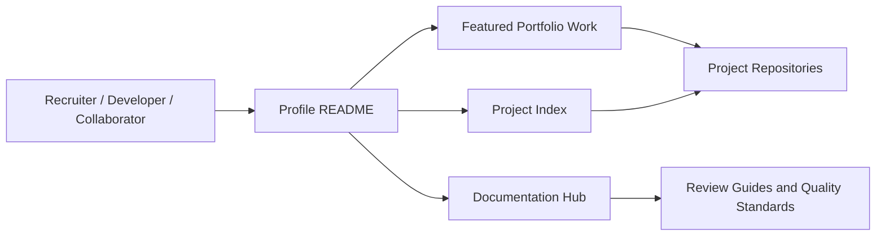
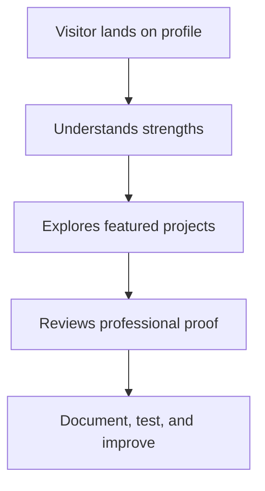
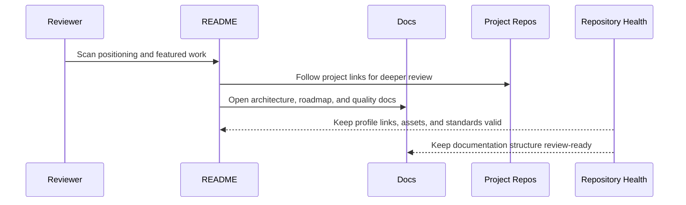

# Architecture — Nikhil Bheda GitHub Portfolio

## Purpose

GitHub profile showcasing full-stack, Flutter, and workflow-focused software projects.

This document explains the project from an engineering-review perspective: layers, workflow, data/state movement, and extension points.

## System Context

## Primary Workflow

## Layered Design

| Layer | Responsibility | Review Focus |
| --- | --- | --- |
| Profile README | First impression, positioning, featured work, review path, and contact links | Can a reviewer understand the profile in 30 seconds? |
| Project Index | Categorized project list across full-stack, Flutter, automation, and applied AI/data work | Can reviewers find the right evidence for their goal? |
| Documentation Hub | Architecture, case study, roadmap, quality, and review docs | Is the portfolio easy to evaluate beyond the README? |
| Repository Health | Markdown linting, link/image checks, widget guards, and documentation requirements | Can the profile stay stable after future edits? |
| Portfolio Metadata | Repository descriptions, topics, homepage links, and resume alignment | Does GitHub search/card context match the portfolio story? |

## Technology Profile

| Category | Value |
| --- | --- |
| Primary stack | Markdown documentation, GitHub Actions, Python validation, SVG assets |
| Repository type | Public GitHub profile and portfolio hub |
| GitHub topics | github-profile, portfolio, profile-readme, documentation, full-stack, flutter |

## Data / State Flow

## Extension Points

- Add screenshots or demo GIFs for the most important workflow.
- Add automated checks that match the stack.
- Add environment documentation if external services are used.
- Add test fixtures or sample data for repeatable demos.
- Convert roadmap items into small, reviewable issues.

## Engineering Review Notes

A strong reviewer should be able to answer:

1. What problem does this project solve?
2. What is the main user workflow?
3. Which files/layers own the core behavior?
4. What tradeoffs are documented?
5. What would be the next professional improvement?
