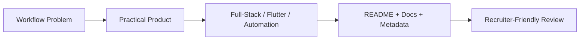

# Project Showcase Catalog

A curated review catalog for Nikhil Bheda's public GitHub portfolio.

Use this page when you want a faster overview than opening every repository one by one.

## Review Priority

| Priority | Repository | Why review it |
| --- | --- | --- |
| 1 | [ExporTrack AI](https://github.com/bhedanikhilkumar-code/ExporTrack-AI) | Best signal for full-stack product thinking, dashboards, operations, and workflow modeling. |
| 2 | [Planora](https://github.com/bhedanikhilkumar-code/Planora) | Strong signal for scheduling logic, data modeling, admin workflows, and PostgreSQL-backed systems. |
| 3 | [Site Surveyor Compass](https://github.com/bhedanikhilkumar-code/site-surveyor-compass) | Best signal for Flutter utility UX, GPS workflows, local storage, and field productivity. |
| 4 | [AutoPortfolio Builder](https://github.com/bhedanikhilkumar-code/AutoPortfolio-Builder) | Strong backend/tooling signal with FastAPI, content automation, auth/admin ideas, and exports. |
| 5 | [Developer Avatar Generator](https://github.com/bhedanikhilkumar-code/Developer-Avatar-Generator) | Developer-tool signal with SVG generation, API/CLI direction, TypeScript, and web UI workflows. |

## Full-Stack / Web Platforms

| Repository | Product Focus | Stack / Keywords |
| --- | --- | --- |
| [ExporTrack AI](https://github.com/bhedanikhilkumar-code/ExporTrack-AI) | Export logistics, shipment tracking, document verification, dashboards | React, TypeScript, Node.js, Express, MySQL, workflow automation |
| [Planora](https://github.com/bhedanikhilkumar-code/Planora) | Calendar/admin platform, recurrence, ICS import/export, event workflows | React, TypeScript, Node.js, Prisma, PostgreSQL, scheduling |
| [Smart Study Planner](https://github.com/bhedanikhilkumar-code/Smart-Study-Planner) | Study planning, backlog tracking, analytics, revision recommendations | JavaScript, productivity, scheduling, AI-assisted planning |
| [Bheda Nikhilkumar Portfolio](https://github.com/bhedanikhilkumar-code/Bheda-Nikhilkumar-portfolio) | Personal portfolio website | JavaScript, portfolio, profile, frontend |

## Flutter / Mobile Apps

| Repository | Product Focus | Stack / Keywords |
| --- | --- | --- |
| [Site Surveyor Compass](https://github.com/bhedanikhilkumar-code/site-surveyor-compass) | GPS workflows, measurement tools, waypoints, field reports | Flutter, Dart, Provider, Hive, Firebase, GPS |
| [Money King](https://github.com/bhedanikhilkumar-code/money-king) | Expense tracking, budgets, cloud sync, passcode and biometric unlock | Flutter, Dart, finance, biometric auth, mobile app |
| [Sanskriti Panchang](https://github.com/bhedanikhilkumar-code/SanskritiPanchang) | Hindu calendar, Panchang, festivals, Choghadiya, Hindi-first UX | Flutter, Dart, Panchang, calendar, mobile app |
| [iOS Emoji Story Maker](https://github.com/bhedanikhilkumar-code/iOS-Emoji-Story-Maker) | Playful emoji story creation and mobile content workflows | Flutter, Dart, emoji, story maker, UI design |
| [NoteinFree](https://github.com/bhedanikhilkumar-code/NoteinFree) | Lightweight note-taking app | Flutter, Dart, notes, mobile productivity |

## Automation / Developer Tools

| Repository | Product Focus | Stack / Keywords |
| --- | --- | --- |
| [AutoPortfolio Builder](https://github.com/bhedanikhilkumar-code/AutoPortfolio-Builder) | GitHub/LinkedIn input to portfolio-ready content and exports | FastAPI, Python, automation, backend, admin tools |
| [Developer Avatar Generator](https://github.com/bhedanikhilkumar-code/Developer-Avatar-Generator) | Deterministic SVG avatars through API, CLI, and web UI | TypeScript, SVG, API, CLI, developer tools |
| [DevBadge Generator](https://github.com/bhedanikhilkumar-code/devbadge-generator) | Animated SVG/PNG badges, stack presets, Markdown copy, bulk export | JavaScript, SVG, badges, README tooling |
| [RepoNova100](https://github.com/bhedanikhilkumar-code/RepoNova100) | AI-assisted project idea planning and generation workflows | FastAPI, Python, CI, testing, project planner |
| [CommitPilot](https://github.com/bhedanikhilkumar-code/CommitPilot) | CLI goal planning and daily commit consistency | Python, CLI, productivity, habit tracking |

## AI / Learning / Experimentation

| Repository | Product Focus | Stack / Keywords |
| --- | --- | --- |
| [AI Interview Simulator Desi Version](https://github.com/bhedanikhilkumar-code/AI-Interview-Simulator-Desi-Version-) | Practice-oriented mock interview workflows | AI, interview practice, learning tools |
| [Gujarati AI Learning Assistant](https://github.com/bhedanikhilkumar-code/Gujarati-Ai-Learning-Assistant) | Gujarati-language educational assistant direction | JavaScript, AI, education, Gujarati |
| [Study Assistant AI](https://github.com/bhedanikhilkumar-code/Study-Assistant-AI) | AI-assisted study support and productivity workflows | TypeScript, AI, learning assistant |
| [Fake News Detector](https://github.com/bhedanikhilkumar-code/fake-news-detector) | NLP-based fake news classification with confidence scoring | Python, machine learning, NLP |

## Hardware / Applied Projects

| Repository | Product Focus | Stack / Keywords |
| --- | --- | --- |
| [Automatic Watering System](https://github.com/bhedanikhilkumar-code/automatic-watering-system) | Arduino-based soil moisture and relay pump automation | C++, Arduino, IoT, sensors |
| [Non-invasive Disease Risk Predictor](https://github.com/bhedanikhilkumar-code/noninvasive-disease-risk-predictor) | Early disease-risk prediction using symptoms, lifestyle, and vitals | JavaScript, health tech, analytics dashboard |
| [AI Manufacturing Intelligence](https://github.com/bhedanikhilkumar-code/ai-manufacturing-intelligence) | Energy optimization and carbon reduction intelligence | Python, ML, manufacturing, energy analytics |

## Portfolio Pattern

Across the projects, the strongest consistent pattern is:

## Next Best Improvements

1. Add screenshots/GIFs to the top 5 repositories.
2. Add demo videos for ExporTrack AI, Planora, and Site Surveyor Compass.
3. Add architecture diagrams to the most important full-stack repositories.
4. Keep live deployment links healthy and documented.
5. Add tests/CI status indicators where projects already include test commands.
